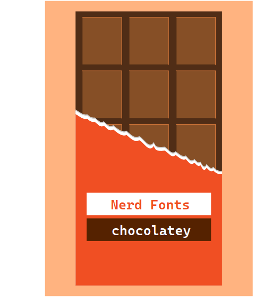

candy-wrap-nerd-fonts is an over engineered script to package up fonts from [the nerd fonts project](https://github.com/ryanoasis/nerd-fonts) as nupkg's to be installed via chocolatey.

I was surprised to find that not to many of the fonts patched by the nerd-fonts where listed in the chocolatey gallery.

My motivation was

* I swapped over from atom to neovim and discovered nerd-fonts !

* I hop from computer to computer a lot and wanted an easy way to install them. Many of these are windows.

* I also change my taste a lot and will often change my font on a whim  

* I like to try and automate things

# creating packages with candy-wrap-nerd-fonts
Open Powershell, clone this repository, cd into the directory and run the script `candy-wrap-nerd-fonts.ps1`. Below is an example of it creating two packages for agave and arimo.

```powershell
# clone the repository
PS>_ git clone https://github.com/pigeonlips/candy-wrap-nerd-fonts.git

# run candy-wrap-nerd-Fonts
PS>_ .\candy-wrap-nerd-fonts\candy-wrap-nerd-fonts.ps1

# packages are now in your current working folder
PS>_ ls *.nupkg


    Directory: C:\temp\fonts


  Mode                 LastWriteTime         Length Name
  ----                 -------------         ------ ----
  -a----         8/12/2022   4:20 PM        1077723 nerd-fonts-agave.2.1.0.nupkg
  -a----         8/12/2022   4:21 PM        5731018 nerd-fonts-arimo.2.1.0.nupkg
```

# how it works

You run `candy-warp-nerd-fonts.ps1` and it should produce one or more packages of nerd-fonts for chocolatey. You can configure what it produces via a small yaml based config file.

Requirements :  
* Powershell (only ever tested on windows 10).
* Chocolatey installed. The script calls `choco pack`.
* [ recommended ] the Powershell-Yaml module to read the config file.

### dont nerd-fonts have there own scripts to package fonts for chocolatey ?

Yes ! Yes they do - I would encourage you to [go use it!](https://github.com/ryanoasis/nerd-fonts/tree/master/chocolatey)

I just wanted something :

* Where I didn't need to clone the large repo.
* Where I could just use PowerShell.
* That could package up a collection of fonts into a single package from time to time.

### why use yaml ? If you used json you there wouldn't be any dependency's other than chocolatey !
The Powershell-Yaml module is used to read the config. To be honest I'm still not sure why at this point the module is not included with powershell by default. I could have used json which would have removed the need to have this module, but I find yaml easier to read and work with. Without the Powershell-Yaml module, the script will continue to work but sane default value are used and you will be unable to change the behavior via the config.

### the package has the fonts inside. why not just use a command to download it like everyone else ?
Personal preference I guess. I like everything needed in the package. If links change or whatever I can trust the package remains as it was at time of creation.

# candy-wrap-nerd-fonts configuration

Configuration is held in the candy-wrap-nerd-fonts.yml file. Its broken into 3 sections. One for the script its self "candywrap". One for chocolatey "choco" and finally one for nerd-fonts called "nerd-fonts"
If an item is not in the config, the script will provide a default if its need.

## candywrap section
Configuration to control the behaviour of the candy-wrap-nerd-fonts script.

```yml
candywrap:
  packpath:                     # defaults to $env:temp\<choco.metadata.id>
  packageperfont: false         # defaults false, when true fonts are packaged individually.
  windowscompatibleonly: true   # defaults to false
  interactive: false            # defaults to true. Will be prompted which fonts to package when nerdfont.fonts is empty
```

* `packpath` : this is the path on disk that is used to create all the files needed to create the chocolatey package. If omitted, it will default to the windows temp directory + the name of the chocolatey package id
* `packageperfont`: more than one font can be specified in the config under the nerd-fonts section. If packageperfont is true it will create a separate chocolatey package per font. The font name will be appended to the chocolatey package id.
* `windowcompatibleonly` : fonts inside the zip files downloaded from nerd-fonts include files marked with "Windows Compatible". If this setting is true, the script will only package these fonts.

> **Note** ~ You could set packageperfont to false if you want to, say, package up a handful of your favourite ones into a single package.

## nerdfont section
Configuration to control the behaviour of how candy-wrap-nerd-fonts interacts with nerd-fonts.

```yml
nerdfont:
  gitrepo: # defaults to "ryanoasis/nerd-fonts"
  gittag:  # defaults to "latest""
  fonts:   # Name of font file as it appears as asset under the nerdfont release page. If not provided the script will provide a gridbox
    - '3270.zip'
    - 'agave.zip'
    - 'AnonymousPro.zip'
    - 'Arimo.zip'
```

* `giturl` : base github url for the nerd-fonts repo. You could change I guess if you want to point it at a fork etc.
* `gittag` : the release tag that should be used to download the zipped up fonts.
* `fonts` : an array of font file name to pull from nerd-fonts. You can find these listed on github under the releases page for nerd-fonts.

> **Note** if `packageperfont` is true, then the font file name (minus the .zip part) will be appended to the chocolatey package id. for example "-agave".

> **Note** - if `fonts` is blank, then the script will try to get a full list of fonts from the release page and draw a dialogue box (using Out-GridView) so you can select the ones you want.

## choco section
Configuration to control the behavior of chocolatey when packaging. Heres an example:
```yml
choco:
  metadata:
    id:                                 # defaults to "nerd-fonts"
    version:                            # defaults to git tag of nerd-fonts used with all letters stripped [a-z] out
    title:                              # defaults to id
    authors: "Ryan L McIntyre"          # defaults to current windows user
    requireLicenseAcceptance: "true"    # default is false
    owners: "ryanoasis"
    packageSourceUrl: "https://github.com/ryanoasis/nerd-fonts"
    projectUrl: "https://nerdfonts.com/"
    iconUrl: "https://imgur.com/pEDFEje"
    licenseUrl: "https://raw.githubusercontent.com/ryanoasis/nerd-fonts/master/LICENSE"
    projectSourceUrl: "https://github.com/ryanoasis/nerd-fonts"
    docsUrl: "https://github.com/ryanoasis/nerd-fonts/wiki"
    bugTrackerUrl: "https://github.com/ryanoasis/nerd-fonts/issues"
    tags: "hasklig hasklug nerd-fonts fonts ligatures coding-fonts"
    summary: |-
      Iconic font aggregator, collection, and patcher. 40+ patched fonts, over 3,600
      glyph/icons, includes popular collections such as Font Awesome &amp; fonts such as Hack.
    description: |-                    # defaults to the id
      Nerd Fonts takes popular programming fonts and adds a bunch of Glyphs.
      There is also a font patcher available if your desired font isn't already patched.
      For more high level information see the wiki.
  files:
    - src: "tools\\**"
      target: "tools"
    - src: "fonts\\**"
      target: "fonts"
```
### metadata subsection
Any key value pair works here, and these are injected in to the metadata section of the nuspec chocolatey will use to create the package. There are only a few that chocolatey requires to package up the fonts and if these are missing, the script will provide sane defaults. These are:

* `id` : this is the "name" of the package as you would install it via chocolatey via `choco install package-id`. Defaults to 'nerd-fonts' + font file name if packageperfont is true.
* `version` : this is the version of the package given to chocolatey. If omitted, then the release tag of nerd fonts downloaded is used. One note is that chocolatey doesn't like a-z characters in the version, and nerd-fonts have release versions such as v2.1.0. Any letters in the release tag are stripped out for the chocolatey version. v2.1.0 would become 2.1.0 for example.
* `title` : defaults to the id used above.
* `authors` : defaults to the current windows user via $env:username.
* `requireLicenseAcceptance` : defaults to false.
* `description` : defaults to id used above.

### files subsection
Again any key value pair can be added. Defaults are shown in the example above. These are used to control what files are added to the package. Unless you are modifying how and what is packaged these shouldn't need to change. If you change this section you would likely need to change the candy-wrap-nerd-fonts script too.  

# credits !

* all the fine people who made the fonts !
* ryanoasis and all the fantastic work from people contributing to nerd fonts !
* chocolatey !
